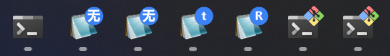

# Taskbar Overlay and Grouping Tool

Add or remove overlay badges on any process's taskbar buttons, or control taskbar grouping. Tested on Windows 11 only.



## How It Works

| Feature | Mechanism |
|---------|-----------|
| Overlay badge | `ITaskbarList3::SetOverlayIcon` COM interface (taskbar copies the icon internally) |
| Badge rendering | GDI+ anti-aliased circle + text, converted to HICON |
| Taskbar grouping | `SHGetPropertyStoreForWindow` with `AppUserModelID` |

OverlayIcon takes effect immediately. The badge persists after the calling process exits, until cleared via `clear_overlay_*` or the target window closes.

## CLI Usage

Window matching parameters (available on all subcommands):

- `--pid N` — exact match by process ID (single window)
- `--pname NAME` — case-insensitive exact match on process name, e.g. `Notepad2_x64.exe`; matches all windows of that process
- `--hwnd HANDLE` — direct window handle (decimal or `0x` hex)
- `--title TEXT` — case-insensitive substring match on window title. **Requires `--pname`**

### set-overlay — Add a badge

```bat
:: Text badge (red by default)
tb_icon set-overlay --pid 1234 --text "3"
tb_icon set-overlay --pid 1234 --text "99+" --color blue
tb_icon set-overlay --pid 1234 --text "!" --color #FF6600
tb_icon set-overlay --pid 1234 --text "5" --color 255,0,0

:: Load from file (.ico / .exe / .dll)
tb_icon set-overlay --pid 1234 --file badge.ico --desc "3 new items"
tb_icon set-overlay --pid 1234 --file shell32.dll --index 44

:: Batch by process name (must match exact name, e.g. Notepad2_x64.exe)
tb_icon set-overlay --pname Notepad2_x64.exe --text "7"

:: pname + title dual filter (both must match)
tb_icon set-overlay --pname Notepad2_x64.exe --title 1.txt --file git.ico

:: Auto-text: omit --file and --text, each window gets its title's first character
tb_icon set-overlay --pname Notepad2_x64.exe
tb_icon set-overlay --pname Notepad2_x64.exe --color blue
```

Icon source priority: `--file` > `--text` > auto-text (first char of window title). `--color` applies to `--text` and auto-text. Supports `#RRGGBB`, `R,G,B`, or named colors.

### clear-overlay — Remove badges

```bat
tb_icon clear-overlay --pid 1234
tb_icon clear-overlay --pname Notepad2_x64.exe
```

### ungroup / regroup — Taskbar grouping

```bat
:: Assign unique AUMID to each window (format: ProcessName.HWND), ungrouping them
tb_icon ungroup Notepad2_x64.exe

:: Custom AUMID prefix
tb_icon ungroup Notepad2_x64.exe --app_id MyEditor

:: Reset to default grouping (clears AUMID for all windows of the process)
tb_icon regroup Code.exe
```

### list — List windows

```bat
:: List all taskbar-eligible windows
tb_icon list

:: Filter by process name (exact match)
tb_icon list Notepad2_x64.exe
```

Output columns: HWND, PID, process name, AUMID, window title.

## Daemon Mode (no arguments)

Running without arguments starts a **system-tray resident daemon**. It applies rules from `tb_icon.ini` to existing windows, then stays in the tray and automatically applies overlay badges to new windows as they open.

| Action | How |
|--------|-----|
| Start | Double-click `tb_icon.exe` or run it with no arguments |
| Edit config | **Double-click** the tray icon to open `tb_icon.ini` in your default editor |
| Reload | Close the editor — the daemon detects the change and re-applies rules automatically |
| Re-apply | Right-click tray icon → **Re-apply** (re-applies current rules to all windows) |
| Reset all | Right-click tray icon → **Reset all** (clears all overlays and re-groups taskbar buttons) |
| Exit | Right-click tray icon → **Exit** |

The daemon uses `SetWinEventHook` to react to new windows as they appear, with a 1-second delay to allow the taskbar button to initialize. INI file changes are detected via `FindFirstChangeNotification` (no polling).

### One-shot mode (`tb_icon once`)

To apply rules and exit immediately (the old behavior), use:

```bat
tb_icon once
tb_icon once "C:\path\to\tb_icon.ini"
```

## Config File Mode

### INI Format

```ini
; Section name = process name (case-insensitive, exact match)
; Each [section] is one rule

[Notepad2_x64.exe]
title = 1.txt
icon = icons\git.ico
desc = git changes

; For multiple windows of the same process, repeat the section
[Notepad2_x64.exe]
title = Untitled
text = 3
color = blue
```

| Field | Description |
|-------|-------------|
| Section name | Process name, case-insensitive, exact match |
| `title` | Window title substring match. Omit to match all windows of the process |
| `icon` | Icon path (.ico/.exe/.dll), relative to ini directory |
| `text` | Text badge (`icon` takes priority; mutually exclusive) |
| `color` | Badge color: `#RRGGBB` or color name |
| `desc` | Accessibility description (read by screen readers) |

### Wildcard and Auto-text

- `title = *` — wildcard that matches all instances of the process (same as omitting `title`, but more explicit). `*` is not treated as a substring filter.
- **Auto-text** — when a rule has neither `icon` nor `text`, each matching window gets a badge from the first character of its real title (after trimming whitespace). `color` and `desc` still apply.
- Windows with empty titles are skipped.

```ini
; Each Notepad2 instance shows its title's first char
[Notepad2_x64.exe]
title = *
color = blue

; Rules are applied in order, you can add overrides
[Notepad2_x64.exe]
title = Report
color = red

; Works with specific title filters too
[WindowsTerminal.exe]
title = MINGW64
icon = C:\Program Files\Git\mingw64\share\git\git-for-windows.ico
```

## Library API Integration

```cmake
add_subdirectory(path/to/taskbar)
target_link_libraries(your_app PRIVATE tb_icon_lib)
```

```cpp
#include <taskbar/tb_icon.h>

int main() {
    taskbar::scoped_com com;  // required before using overlay APIs

    // Set badge by PID
    HICON icon = taskbar::create_badge_icon(L"3", RGB(220, 38, 38));
    taskbar::set_overlay_by_pid(1234, icon, L"3 unread");
    taskbar::destroy_icon(icon);  // safe to destroy immediately; taskbar copies it

    // Find window by title + process name, then set
    HICON icon2 = taskbar::load_icon_from_file(L"badge.ico");
    taskbar::set_overlay_by_title(L"Notepad2-mod", L"Notepad2_x64.exe", icon2, L"new");
    taskbar::destroy_icon(icon2);

    return 0;
}
```

| Category | Functions |
|----------|-----------|
| Lifecycle | `scoped_com` |
| Window discovery | `find_window`, `find_window_by_pid`, `list_windows_by_pid` |
| Window info | `get_window_title`, `get_process_name` |
| Icon creation | `load_icon_from_file`, `create_badge_icon`, `destroy_icon` |
| Set overlay | `set_overlay_by_hwnd`, `set_overlay_by_pid`, `set_overlay_by_title` |
| Clear overlay | `clear_overlay_by_hwnd`, `clear_overlay_by_pid`, `clear_overlay_by_title` |
| Taskbar grouping | `set_app_user_model_id`, `get_app_user_model_id` |

